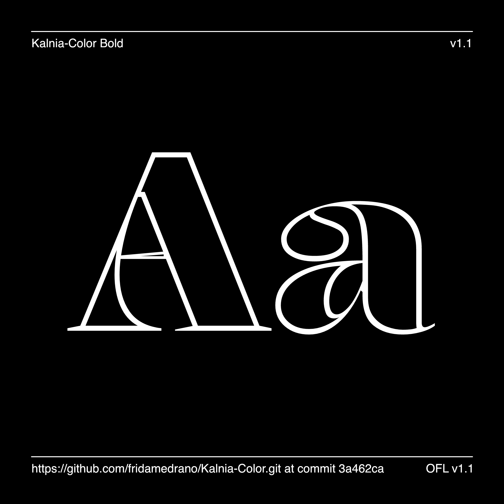

# Kalnia Glaze

<!-- [![][Fontbakery]](https://fridamedrano.github.io/Kalnia-Typeface/fontbakery/fontbakery-report.html)
[![][Universal]](https://fridamedrano.github.io/Kalnia-Typeface/fontbakery/fontbakery-report.html)
[![][GF Profile]](https://fridamedrano.github.io/Kalnia-Typeface/fontbakery/fontbakery-report.html)
[![][Outline Correctness]](https://fridamedrano.github.io/Kalnia-Typeface/fontbakery/fontbakery-report.html)
[![][Shaping]](https://fridamedrano.github.io/Kalnia-Typeface/fontbakery/fontbakery-report.html)-->

[Fontbakery]: https://img.shields.io/endpoint?url=https%3A%2F%2Fraw.githubusercontent.com%2Ffridamedrano%2FKalnia-Typeface%2Fgh-pages%2Fbadges%2Foverall.json
[GF Profile]: https://img.shields.io/endpoint?url=https%3A%2F%2Fraw.githubusercontent.com%2Ffridamedrano%2FKalnia-Typeface%2Fgh-pages%2Fbadges%2FGoogleFonts.json
[Outline Correctness]: https://img.shields.io/endpoint?url=https%3A%2F%2Fraw.githubusercontent.com%2Ffridamedrano%2FKalnia-Typeface%2Fgh-pages%2Fbadges%2FOutlineCorrectnessChecks.json
[Shaping]: https://img.shields.io/endpoint?url=https%3A%2F%2Fraw.githubusercontent.com%2Ffridamedrano%2FKalnia-Typeface%2Fgh-pages%2Fbadges%2FShapingChecks.json
[Universal]: https://img.shields.io/endpoint?url=https%3A%2F%2Fraw.githubusercontent.com%2Ffridamedrano%2FKalnia-Typeface%2Fgh-pages%2Fbadges%2FUniversal.json

Kalnia Glaze is an innovative typeface that merges the new color gradient font technology, variable font capabilities and introduces a dynamic transparency variation as an extra layer.

Much like the Victorian Sash windows that were meticulously glazed to capture a timeless charm, 'Kalnia Glaze' incorporates the essence of this historical craftsmanship into its letterforms. Just like the structural elegance, volume, and lighting nuances of victorian windows, Kalnia Glaze adds new layers of complexity and decoration enhancing the original structure of Kalnia typeface.

Kalnia Glaze is the result of an broad exploration of the latest COLRv1 format and it’s integration with the variable font technology. The objective was not only to create a complex layered design to explore the possibilities of the format but also to streamline and expedite the process, minimizing the need for manual adjustments through software and emphasizing the automation of processes using paintcompiler.

Minisite: http://fridamedrano.com/kalnia 

## About Frida Medrano

Frida Medrano is a Mexican type and interaction designer currently based in San Fransisco, California. She is interested in design automation and exploration projects where code and design converge. In recognition of her contributions, she was honored with the SOTA Catalyst Award in 2018. Frida has showcased her work at forums such as ATypI, TypeLab, TypeCon,  Design Matters, IxDA, Letrástica, and TMX.

[fridamedrano.com](http://www.fridamedrano.com)
[Instagram](https://www.instagram.com/fridaemg) [GitHub](https://github.com/fridamedrano) [Twitter](https://twitter.com/fridaemg)

## Building

This process of this project is divided in two:
- Glyphs file: This file is located on the source folder and it contain the letterforms designs and the variable font parameters. This is constructed using two color palettes (letter’s inside and stroke).
- Build script: This script has the paintcompiler program by Simon Cozens added to the build to replace the color palettes with the gradients and alphas directions.

Fonts are built automatically by GitHub Actions - take a look in the "Actions" tab for the latest build.

If you want to build fonts manually on your own computer:

* `make build` will produce font files.
* `make test` will run [FontBakery](https://github.com/googlefonts/fontbakery)'s quality assurance tests.
* `make proof` will generate HTML proof files.

The proof files and QA tests are also available automatically via GitHub Actions - look at https://fridamedrano.github.io/Kalnia-Color.

## Changelog

**3 January 2024. Version 1.00**

## License

This Font Software is licensed under the SIL Open Font License, Version 1.1.
This license is available with a FAQ at
https://scripts.sil.org/OFL

## Repository Layout

This font repository structure is inspired by [Unified Font Repository v0.3](https://github.com/unified-font-repository/Unified-Font-Repository), modified for the Google Fonts workflow.
