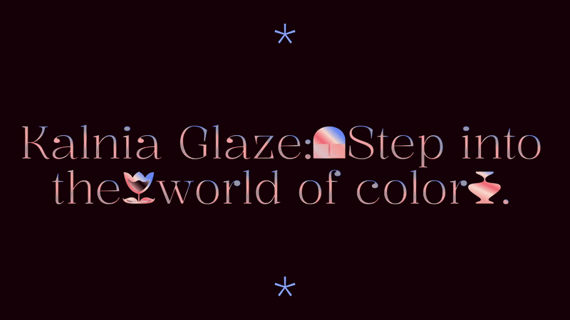
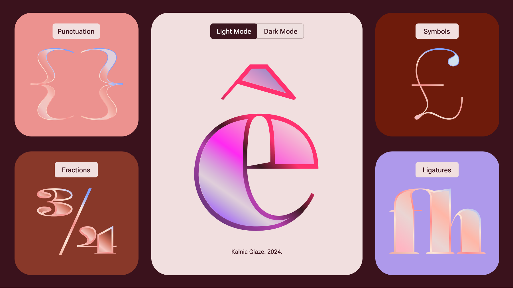

# Kalnia Glaze: Step into the World of Color.

A new gradient variable font by Frida Medrano.

Minisite: https://www.fridamedrano.com/kalniaglaze

<!-- [![][Fontbakery]](https://fridamedrano.github.io/Kalnia-Typeface/fontbakery/fontbakery-report.html)
[![][Universal]](https://fridamedrano.github.io/Kalnia-Typeface/fontbakery/fontbakery-report.html)
[![][GF Profile]](https://fridamedrano.github.io/Kalnia-Typeface/fontbakery/fontbakery-report.html)
[![][Outline Correctness]](https://fridamedrano.github.io/Kalnia-Typeface/fontbakery/fontbakery-report.html)
[![][Shaping]](https://fridamedrano.github.io/Kalnia-Typeface/fontbakery/fontbakery-report.html)-->

[Fontbakery]: https://img.shields.io/endpoint?url=https%3A%2F%2Fraw.githubusercontent.com%2Ffridamedrano%2FKalnia-Typeface%2Fgh-pages%2Fbadges%2Foverall.json
[GF Profile]: https://img.shields.io/endpoint?url=https%3A%2F%2Fraw.githubusercontent.com%2Ffridamedrano%2FKalnia-Typeface%2Fgh-pages%2Fbadges%2FGoogleFonts.json
[Outline Correctness]: https://img.shields.io/endpoint?url=https%3A%2F%2Fraw.githubusercontent.com%2Ffridamedrano%2FKalnia-Typeface%2Fgh-pages%2Fbadges%2FOutlineCorrectnessChecks.json
[Shaping]: https://img.shields.io/endpoint?url=https%3A%2F%2Fraw.githubusercontent.com%2Ffridamedrano%2FKalnia-Typeface%2Fgh-pages%2Fbadges%2FShapingChecks.json
[Universal]: https://img.shields.io/endpoint?url=https%3A%2F%2Fraw.githubusercontent.com%2Ffridamedrano%2FKalnia-Typeface%2Fgh-pages%2Fbadges%2FUniversal.json

Kalnia Glaze is a new typeface commissioned by Google Fonts, that experiments with the new color font technology in variable fonts, inviting you to step into a world of color and add vibrancy and depth to your projects.


## A Glaze of Possibilities.

Kalnia Glaze is the result of an broad exploration of the latest COLRv1 format and it’s integration with the variable font technology. The objective was not only to create a complex layered design to explore the possibilities of the format but also to streamline and expedite the process, minimizing the need for manual adjustments through software and emphasizing the automation of processes using [paintcompiler](https://github.com/simoncozens/paintcompiler), a program by Simon Cozens.


COLRv1 is the latest version of the color font format combining transparency, gradients, and variable font technology. As one of the advantages of the format, it's possible to change the color palettes in code. CSS serves as a powerfull tool to change palettes.


## CSS Palettes
Kalnia Glaze is designed for both light and dark modes, with easily accessible palettes through CSS.

### Light Mode (default color)
```html
h1 {
  font-family: 'Kalnia Glaze';
  font-palette: light; #light mode
}
```

### Dark Mode
```html
h1 {
  font-family: 'Kalnia Glaze';
  font-palette: dark; #dark mode
}
```

### Custom Palettes
You can customize colors in CSS or use tools like DJR's color font customizer (https://tools.djr.com/color-font-customizer) or Laurence Penney's Figma plugin (https://github.com/Lorp/figma-colrv1), both offering easy and powerful customization options.

## About the Design

Inspired by the Victorian era, Kalnia Glaze features high contrast and refined terminals. Much like the Victorian Sash windows that were meticulously glazed to capture a timeless charm, Kalnia Glaze takes the essence of this historical craftsmanship into its letterforms. It incorporate their structural elegance, volume, and lighting nuances, to enhance the original structure of  Kalnia typeface with added complexity and decoration.

Kalnia Glaze is the color font version of [Kalnia Typeface](https://fonts.google.com/specimen/Kalnia) also available at Google Fonts.






## About Frida Medrano

Frida Medrano is a Mexican type and product designer currently based in San Fransisco, California. She is interested in design automation and exploration projects where code and design converge. She won the SOTA Catalyst Award in 2018 and has presented her work in forums like ATypI, TypeLab, TypeCon, Design Matters, IxDA, Letrástica, and TMX.

[fridamedrano.com](http://www.fridamedrano.com)
[Instagram](https://www.instagram.com/fridaemg) [GitHub](https://github.com/fridamedrano) [Twitter](https://twitter.com/fridaemg)

## Aditional Credits

This project was possible thanks to Google Fonts and the support of Viviana Monsalve, Simon Cozens and Dave Crossland.

## Building

Kalnia is divided in two sections:
- Kalnia-Glaze.glyphs: This file contain the letterforms design and the variable font parameters. It's constructed using two color palettes: the stroke and the fill. Note: The colors on this palette are random, they will be replace in the next step.
- Paints.py file: This script is dependent from paintcompiler, a program by Simon Cozens. As a second step, paintcompiler (incorporated on the build) replace the color palettes in the Glyphs file with the gradients and alphas described on the paints.py file.

These files are available in the sources folder.
As a summary, the Glyphs file contain the letterform designs and interpolation settings and the paints.py file the color gradients.

Fonts are built automatically by GitHub Actions - take a look in the "Actions" tab for the latest build.


If you want to build fonts manually on your own computer:

* `make build` will produce font files.
* `make test` will run [FontBakery](https://github.com/googlefonts/fontbakery)'s quality assurance tests.
* `make proof` will generate HTML proof files.

The proof files and QA tests are also available automatically via GitHub Actions - look at https://github.com/fridamedrano/Kalnia-Glaze


## Changelog

**5 March 2024. Version 1.00**

## License

This Font Software is licensed under the SIL Open Font License, Version 1.1.
This license is available with a FAQ at
https://scripts.sil.org/OFL

## Repository Layout

This font repository structure is inspired by [Unified Font Repository v0.3](https://github.com/unified-font-repository/Unified-Font-Repository), modified for the Google Fonts workflow.
